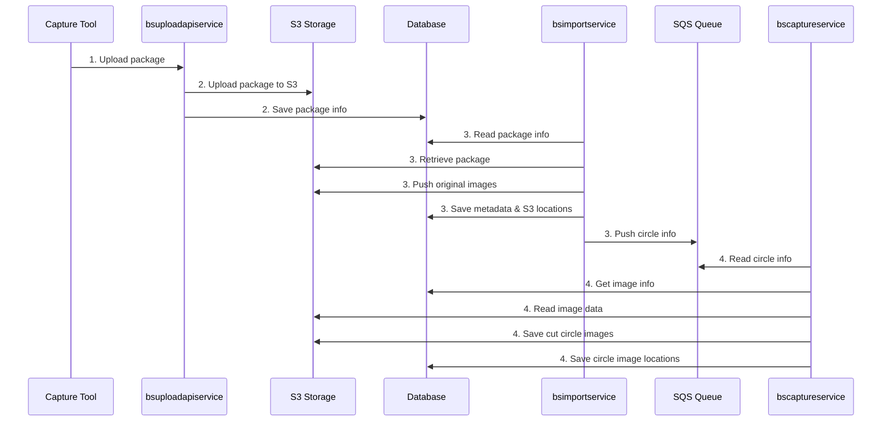
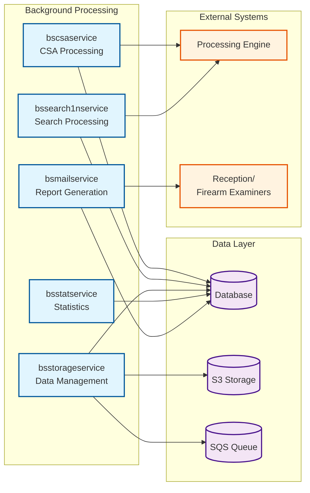
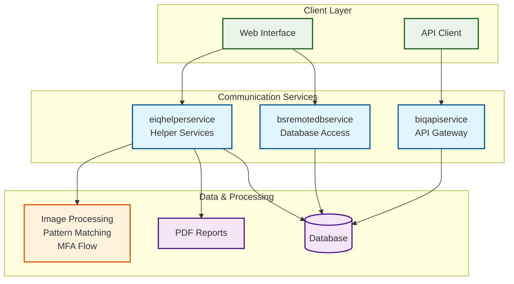

# BIQ System Architecture Diagram

## Overview

```mermaid
graph TB
    %% External Components
    CT[Capture Tool] --> BUAS[bsuploadapiservice]
    API_CLIENT[API Client] --> BAPI[biqapiservice]
    WEB[Web Interface] --> BRDB[bsremotedbservice]
    WEB --> EIQ[eiqhelperservice]
    
    %% Import Flow
    BUAS --> S3[(S3 Storage)]
    BUAS --> DB[(Database)]
    BIS[bsimportservice] --> DB
    BIS --> S3
    BIS --> SQS[(SQS Queue)]
    BCAP[bscaptureservice] --> SQS
    BCAP --> DB
    BCAP --> S3
    
    %% Background Services
    BCSA[bscsaservice] --> DB
    BCSA --> ENG[ENGINE]
    BS1N[bssearch1nservice] --> DB
    BS1N --> ENG
    BSST[bsstorageservice] --> DB
    BSST --> S3
    BSTAT[bsstatservice] --> DB
    BMAIL[bsmailservice] --> DB
    BMAIL --> USERS[Reception/Firearm Examiners]
    
    %% Communication Services
    BRDB --> DB
    BAPI --> DB
    EIQ --> DB
    EIQ --> REPORTS[PDF Reports]
    
    %% Styling
    classDef service fill:#e1f5fe,stroke:#01579b,stroke-width:2px
    classDef storage fill:#f3e5f5,stroke:#4a148c,stroke-width:2px
    classDef external fill:#e8f5e8,stroke:#1b5e20,stroke-width:2px
    classDef engine fill:#fff3e0,stroke:#e65100,stroke-width:2px
    
    class BUAS,BIS,BCAP,BCSA,BS1N,BSST,BSTAT,BMAIL,BRDB,BAPI,EIQ service
    class S3,DB,SQS storage
    class CT,API_CLIENT,WEB,USERS external
    class ENG,REPORTS engine
```

## Detailed Import Process Flow

## Background Services Architecture

## Communication Services Layer

## Component Responsibilities

### Import Services
- **bsuploadapiservice**: Handles package uploads and initial S3 storage
- **bsimportservice**: Processes packages, extracts data, manages image storage
- **bscaptureservice**: Processes circle cutting from uploaded images

### Background Processing Services  
- **bscsaservice**: CSA (Cartridge Case Analysis) processing with external engine
- **bssearch1nservice**: 1:N search processing and result management
- **bsstorageservice**: Data sharing, RBT, auditing, and annotation processing
- **bsstatservice**: Statistics calculation for gallery, auditing, RBT, contracts
- **bsmailservice**: Report generation and email distribution

### Communication Services
- **bsremotedbservice**: Database access layer for web interface
- **biqapiservice**: API gateway for external clients
- **eiqhelperservice**: PDF generation, real-time image processing, MFA flow