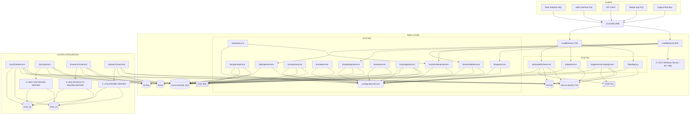

```mermaid
flowchart TB
 subgraph CLIENTLAYER["CLIENT"]
    WEB_BIQ["Web Interface BIQ"]
    WEB_FIQ["Web Interface FIQ"]
    API_CLIENT["API Client"]
    MOBILE["Mobile App FIQ"]
    CAPTURETOOL["CaptureTool Box"]
  end

 subgraph AWS["AWS CLOUD"]
    DB_BIQ[("Aurora MySQL BIQ")]
    DB_FIQ[("Aurora MySQL FIQ")]
    S3_BIQ[("S3 BIQ")]
    S3_FIQ[("S3 FIQ")]
    SQS_BIQ[["SQS BIQ"]]
    SQS_FIQ[["SQS FIQ"]]
    REDIS[("Redis")]
    LOADBALANCER_BIQ["LoadBalancer BIQ"]
    LOADBALANCER_FIQ["LoadBalancer FIQ"]
    EC2_BIQ["2 x EC2 Windows Server / IID / BIQ"]

    subgraph ECS_BIQ["ECS BIQ"]
      biqapiservice["biqapiservice"]
      bscaptureservice["bscaptureservice"]
      bscontrollerapiservice["bscontrollerapiservice"]
      bsimportservice["bsimportservice"]
      bsmailservice["bsmailservice"]
      bsremotedbservice["bsremotedbservice"]
      bsstatservice["bsstatservice"]
      bsstorageservice["bsstorageservice"]
      bsuploadapiservice["bsuploadapiservice"]
      bswebservice["bswebservice"]
      configurationservice["configurationservice"]
      eiqhelperservice["eiqhelperservice"]
    end
    
    subgraph ECS_FIQ["ECS FIQ"]
      fiqwebproxy["fiqwebproxy"]
      siqapiservice["siqapiservice"]
      siqapiservice-background["siqapiservice-background"]
      spstandardizeservice["spstandardizeservice"]
    end
  end

  subgraph ONPREMISE["AUSTIN DATACENTER"]
    NAS_01[("NAS_01")]
    NAS_02[("NAS_02")]
    BIQ_PL_ENGINE["3 x BIQ SEARCH PL ENGINE SERVER"]
    BIQ_CSA_ENGINE["2 x BIQ CSA ENGINE SERVER"]
    FIQ_ENGINE["2 x FIQ ENGINE SERVER"]
    
    SyncDataService["SyncDataService"]
    bscsaservice["bscsaservice"]
    bssearch1nservice["bssearch1nservice"]
    spsearch1nservice["spsearch1nservice"]
  end

  WEB_BIQ --> CLOUDFLARE["CLOUDFLARE"]
  WEB_FIQ --> CLOUDFLARE["CLOUDFLARE"]
  API_CLIENT --> CLOUDFLARE
  MOBILE --> CLOUDFLARE
  CAPTURETOOL --> CLOUDFLARE
  CLOUDFLARE --> LOADBALANCER_BIQ & LOADBALANCER_FIQ
  
  %% =================== AWS BIQ ===================

  %% API for Client call
  LOADBALANCER_BIQ --> biqapiservice
  biqapiservice --> DB_BIQ

  %% Background task: cut circle images
  bscaptureservice --> DB_BIQ
  bscaptureservice --> SQS_BIQ

  %% API for mortiter dashboard / debug
  LOADBALANCER_BIQ --> bscontrollerapiservice
  bscontrollerapiservice --> DB_BIQ

  %% Background task: import gallery
  bsimportservice --> DB_BIQ
  bsimportservice --> SQS_BIQ

  %% Background task : send emails
  bsmailservice --> DB_BIQ

  %% API for main web call
  LOADBALANCER_BIQ --> bsremotedbservice
  bsremotedbservice --> DB_BIQ & REDIS

  %% Background task: statisctic countting VCC, gallery
  bsstatservice --> DB_BIQ

  %% Background task: storing data VCC, auditing, anotation, sharing
  bsstorageservice --> DB_BIQ
  bsstorageservice --> SQS_BIQ
  bsstorageservice --> S3_BIQ

  %% API for CaptureTool Box upload data
  LOADBALANCER_BIQ --> EC2_BIQ
  LOADBALANCER_BIQ --> bsuploadapiservice
  bsuploadapiservice --> DB_BIQ & S3_BIQ

  %% Web frontend for mortiter dashboard / debug
  bswebservice --> bscontrollerapiservice

  %% storing configuration of all services
  biqapiservice --> configurationservice
  bscaptureservice --> configurationservice
  bscontrollerapiservice --> configurationservice
  bsimportservice --> configurationservice
  bsmailservice --> configurationservice
  bsremotedbservice --> configurationservice
  bsstatservice --> configurationservice
  bsstorageservice --> configurationservice
  bsuploadapiservice --> configurationservice
  bswebservice --> configurationservice
  eiqhelperservice --> configurationservice

  %% API for main web call
  LOADBALANCER_BIQ --> eiqhelperservice
  eiqhelperservice --> DB_BIQ

  %% =================== END AWS BIQ ===================


  %% =================== AWS FIQ ===================
  %% API for routing to FIQ WEB (static hosted in S3)
  LOADBALANCER_FIQ --> fiqwebproxy
  fiqwebproxy --> S3_FIQ

  %% API: used for main FIQ WEB, Mobile upload
  LOADBALANCER_FIQ --> siqapiservice
  siqapiservice --> DB_FIQ
  
  %% Background task: import catalog, evidence
  siqapiservice-background --> DB_FIQ & S3_FIQ & SQS_FIQ

  %% API: FIQ Web call for image processing
  %% Background task: standardize images
  LOADBALANCER_FIQ --> spstandardizeservice
  spstandardizeservice -->  DB_FIQ & S3_FIQ & SQS_FIQ

  %% use same configuration service with BIQ
  fiqwebproxy --> configurationservice
  siqapiservice --> configurationservice
  siqapiservice-background --> configurationservice
  spstandardizeservice --> configurationservice
  %% =================== END AWS FIQ ===================

  %% =================== AUSTIN Datacenter ===================
  %% Background task: Run CSA Tasks
  bscsaservice --> DB_BIQ & S3_BIQ & REDIS & BIQ_CSA_ENGINE
  
  %% Background task: Run Search 1N / PL Tasks
  bssearch1nservice --> DB_BIQ & S3_BIQ & REDIS & BIQ_PL_ENGINE
  
  %% Background task: Run Search Footwear Tasks
  spsearch1nservice --> DB_FIQ & S3_FIQ & REDIS & FIQ_ENGINE

  %% Background task: Run Sync Data from AWS to on-premise NAS
  SyncDataService --> DB_BIQ & DB_FIQ & S3_BIQ & S3_FIQ & NAS_01 & NAS_02
  
  BIQ_PL_ENGINE --> NAS_01 & NAS_02
  BIQ_CSA_ENGINE --> NAS_01 & NAS_02
  FIQ_ENGINE --> NAS_01 & NAS_02
  %% =================== END AUSTIN Datacenter ===================
```
