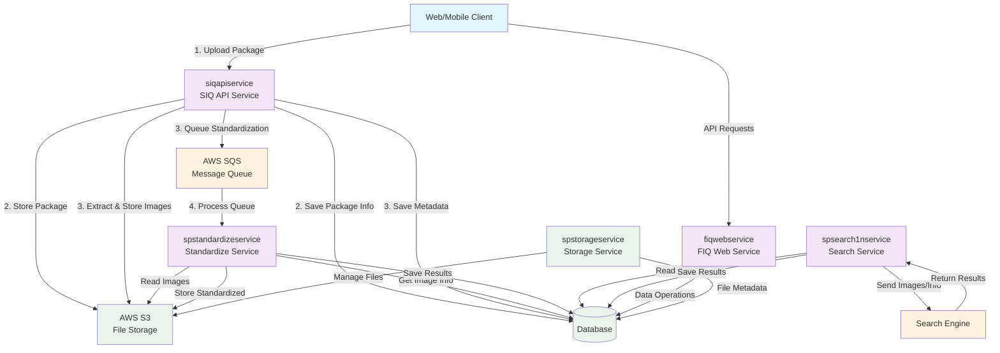

# FIQ System Architecture Diagram

## System Components

### Services
- **siqapiservice**: Main API service handling package uploads and processing
- **fiqwebservice**: Web service for client communication and data retrieval
- **spstandardizeservice**: Image standardization processing service
- **spsearch1nservice**: Background search and matching service
- **spstorageservice**: File storage management service

### Infrastructure
- **AWS S3**: Object storage for packages and images
- **Database**: Metadata and processing results storage
- **AWS SQS**: Message queue for asynchronous processing
- **Search Engine**: External engine for image matching and search

## Process Flow

### Import Workflow
1. **Web/Mobile** uploads package to **siqapiservice**
2. **siqapiservice** uploads package to **S3**, saves package info to **database**
3. **siqapiservice** extracts data, stores original images in **S3**, saves **metadata** and **S3 locations** to **database**, queues **standardization info** to **SQS**
4. **spstandardizeservice** processes **SQS** messages, retrieves images from **S3**, performs **standardization**, saves **standardized images** to **S3** and updates **database**

### Background Processing
1. **spsearch1nservice** reads data from **database**, sends info/images to **Search Engine**
2. Waits for processing completion and saves results to **database**
3. Stores **probe, hits, and search filters** information to **database**

### Communication
1. **fiqwebservice**: Handles web requests for retrieving/saving data from/to **database**