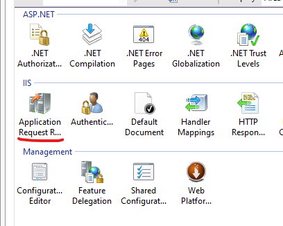
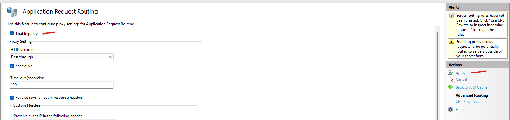
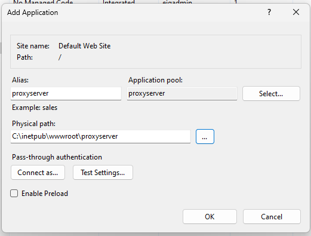
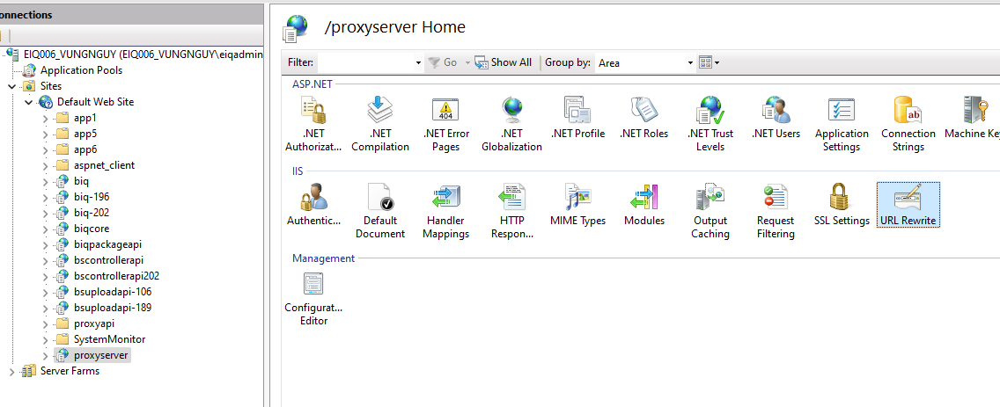
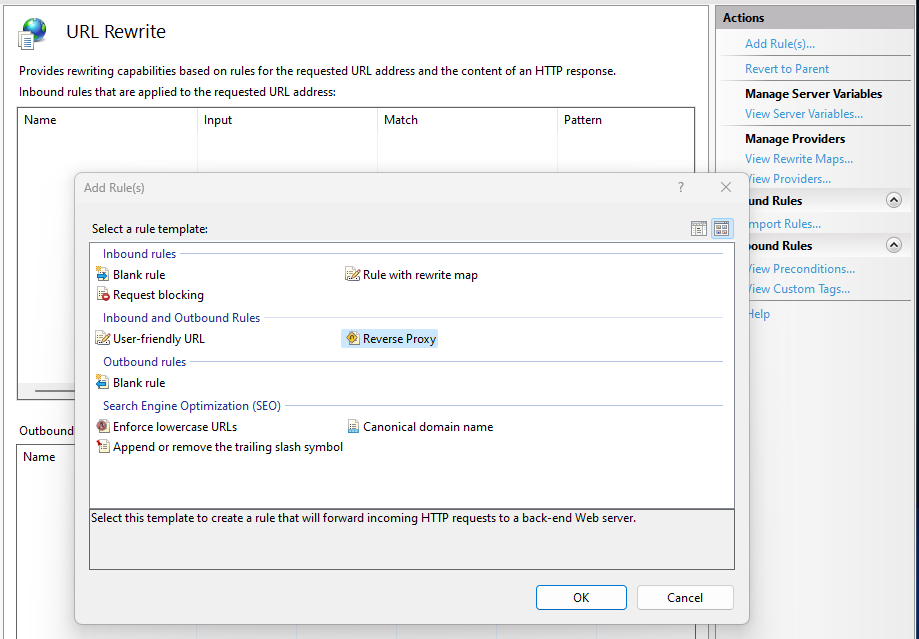
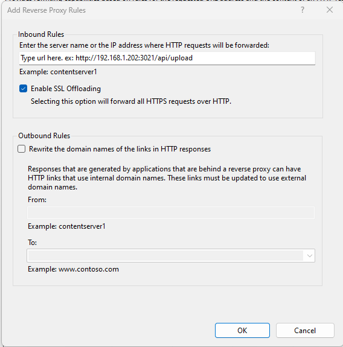
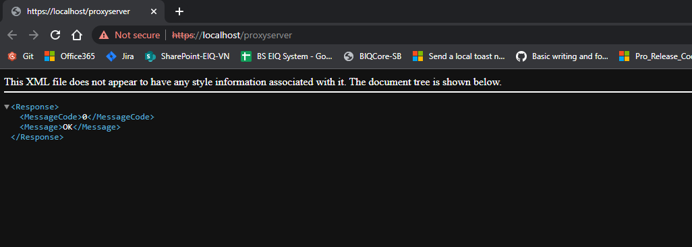

# Package paths

## Components:

### Application Request Routing:
- Local: //[PC201]/public/Softs/iis/requestRouter_amd64.msi
- Network: https://go.microsoft.com/fwlink/?LinkID=615136

### URL Rewrite:
- Local: //[PC201]/public/Softs/iis/rewrite_amd64_en-US.msi
- Network: https://download.microsoft.com/download/1/2/8/128E2E22-C1B9-44A4-BE2A-5859ED1D4592/rewrite_amd64_en-US.msi

## Configurations

### Steps:

#### Step 1: Install 2 components above (restart server required)

#### Step 2: Open <b>IIS</b>

#### Step 3: Configure <b>Application Request Routing</b>

- Double-click Application Request Routing Cache 

    

- Right click -> Select <b>Server Proxy Settings...</b>

    

- Tick <b>Enable proxy</b> -> <b>Apply</b>

    

#### Step 4: Configure <b>URL Rewrite</b>

- Create an application in the <b>Default Web Site</b> or <b>Other sites...</b>

    

- Select that application -> In the right panel, double-click <b>URL Rewrite</b>

    

- Click to <b>Add rule(s)...</b>, select <b>Reverse Proxy</b> -> OK

    

- Type the URL to be Proxy to...

    

- Result

    